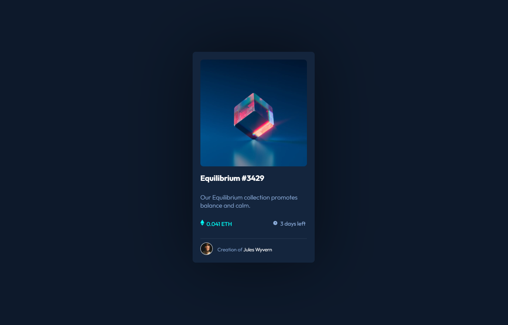

# Frontend Mentor - NFT preview card component solution

This is a solution to the [NFT preview card component challenge on Frontend Mentor](https://www.frontendmentor.io/challenges/nft-preview-card-component-SbdUL_w0U). Frontend Mentor challenges help you improve your coding skills by building realistic projects. 

## Table of contents

- [Overview](#overview)
  - [The challenge](#the-challenge)
  - [Screenshot](#screenshot)
  - [Links](#links)
- [My process](#my-process)
  - [Built with](#built-with)
  - [What I learned](#what-i-learned)
  - [Continued development](#continued-development)
- [Author](#author)
- [Acknowledgments](#acknowledgments)

## Overview

### The challenge

Users should be able to:

- View the optimal layout depending on their device's screen size
- See hover states for interactive elements

### Screenshot



### Links

- Solution URL: [here](https://www.frontendmentor.io/solutions/nft-card-preview-qgbFvBW7m)
- Live Site URL: [here](https://nft-preview-card-virid.vercel.app/)

## My process

### Built with

- CSS custom properties
- Flexbox
- CSS
- Mobile-first workflow
- HTML

### What I learned

I learned about using flexbox with this challenge. 

```html
<div class="flex-container">
      <div class="ethereum-image-container">
        
        0.041 ETH
      </div>
```
```css
.flex-container {
  display: flex;
  flex-direction: row;
  justify-content: space-between;
  width: 100%;
  flex-wrap: nowrap;
  align-items: center;
}

```

### Continued development

I want to do more Frontend Mentor challenges with Bootstrap, the grid system for which might be easier for aligning items nicely.

## Author

- [Profile](https://github.com/kelseychristensen "Kelsey Christensen")
- [Email](mailto:kelsey.c.christensen@gmail.com?subject=Hi "Hi!")
- [Dribble](https://dribbble.com/kelseychristensen "Hi!")
- [Website](http://kelseychristensen.com/ "Welcome")

## Acknowledgments

Thank you to the community at FrontEnd mentor--especially other users who leave feedback!
